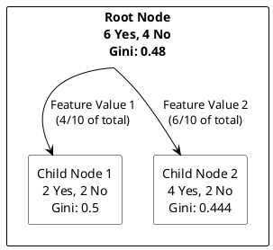

### Overview of Decision Trees

Decision Trees are versatile machine learning algorithms that can perform both classification and regression tasks. They are particularly popular due to their ease of interpretation and implementation. A decision tree builds a model that predicts the value of a target variable by learning simple decision rules inferred from the data features.

### How Decision Trees Work

A decision tree splits the data into branches, which represent decisions or conditions on the features. This process continues recursively, splitting the data into finer subsets until the stopping criteria are met, which could be a maximum depth of the tree, a minimum number of samples in a node, or other complexity considerations.

### Hunt's Algorithm

**Hunt's Algorithm** is a classical approach to building decision trees. It recursively partitions the data into purer subsets, starting from the root node and branching out based on the most informative feature.

#### Steps of Hunt's Algorithm:

1. **Start at the root node**: Include all the training examples.
2. **Check for homogeneity**:
   - If all examples belong to the same class, make this node a leaf node with that class label.
   - If examples are a mix of classes, choose a feature to split on that best separates the classes.
3. **Split the data**:
   - For each value of the selected feature, create a child node.
   - Partition the training examples to these child nodes based on their feature values.
4. **Recursion**:
   - Apply the same process to each child node.

#### Example of Hunt's Algorithm

Consider a dataset with features like "Outlook" (Sunny, Overcast, Rain) and the target "Play Tennis" (Yes, No). Starting with the entire dataset, if the best feature to split on is "Outlook," then create three child nodes for Sunny, Overcast, and Rain. If all examples in the Overcast node are "Yes," then this becomes a leaf node with label "Yes."

### Impurity Measures and Gini Gain

In decision trees, the choice of where to split the data is critical and is based on impurity measures, which quantify how mixed the classes are in a set.

#### Common Impurity Measures:

- **Entropy**: Measures the level of uncertainty or randomness. Defined as:
  $$
  \text{Entropy}(S) = -\sum_{i=1}^{c} p_i \log_2 p_i
  $$
  where $p_i$ is the proportion of class $i$ examples in set $S$.

- **Gini Index**: Measures the probability of a randomly chosen sample being incorrectly labeled if it was randomly labeled according to the distribution of labels in the set.
  $$
  \text{Gini}(S) = 1 - \sum_{i=1}^{c} p_i^2
  $$

#### Gini Gain

The **Gini Gain** is a measure used in decision trees to determine the effectiveness of a split. It is calculated as the difference between the Gini impurity of the parent node before the split and the sum of the Gini impurities of the child nodes, weighted by their sizes, after the split.

### What Does Gini Gain Indicate?

- **Gini Gain** indicates the amount of impurity or disorder that is reduced by splitting the data on a particular feature.
- It essentially measures how well a feature separates the training examples into class-homogeneous groups.

### High vs. Low Gini Gain Values

- **High Gini Gain**: A high Gini gain value is better because it means that the split has significantly reduced the impurity in the child nodes compared to the parent node. This indicates that the feature used for the split has done a good job at categorizing the data into purer subsets, where each subset is more likely to contain examples from a single class. A high Gini gain value leads to a more "pure" division, making the decision tree more effective at classifying new instances.

- **Low Gini Gain**: A low Gini gain value suggests that the split did not do a good job of reducing impurity. This means the feature used for the split does not effectively distinguish between the classes, resulting in subsets that are still mixed or nearly as mixed as before the split. In such cases, the feature may not be useful for making decisions at that point in the tree, and another feature might be considered for splitting.
$$
\text{Gini Gain} = \text{Gini Before Split} - \text{Weighted Gini After Split}
$$

### Example of Gini Gain Calculation

Consider a decision node in a decision tree with two classes (Yes, No) and the following counts:

- Parent node has 10 samples: 6 Yes, 4 No.

Calculate the Gini impurity of the parent node:

$$
\text{Gini}(S) = 1 - \left(\left(\frac{6}{10}\right)^2 + \left(\frac{4}{10}\right)^2\right) = 1 - (0.36 + 0.16) = 0.48
$$

Suppose a split on a feature divides the node into two child nodes:
- Child Node 1: 2 Yes, 2 No
- Child Node 2: 4 Yes, 2 No

Calculate the Gini impurity for each child node:
- For Child Node 1:
$$
\text{Gini}(S1) = 1 - \left(\left(\frac{2}{4}\right)^2 + \left(\frac{2}{4}\right)^2\right) = 0.5
$$
- For Child Node 2:
$$
\text{Gini}(S2) = 1 - \left(\left(\frac{4}{6}\right)^2 + \left(\frac{2}{6}\right)^2\right) = 0.444
$$

Calculate the weighted Gini for the split:
$$
\text{Weighted Gini} = \left(\frac{4}{10} \times 0.5\right) + \left(\frac{6}{10} \times 0.444\right) = 0.2 + 0.2664 = 0.4664
$$

Calculate the Gini gain:
$$
\text{Gini Gain} = 0.48 - 0.4664 = 0.0136
$$

Here, the Gini gain is relatively low, suggesting that the split has not significantly improved the purity of the classes. This example demonstrates how Gini gain evaluates the effectiveness of a split, with higher values indicating a more beneficial split in terms of class separation.

### Practical Example of Decision Tree Application

#### Scenario:
You are given data about customers' age, income, and whether they bought a subscription plan (Yes or No). You need to build a decision tree to predict new customers' behavior based on this data.

1. **Starting Point**: Evaluate all features and calculate the Gini index for splits on "Age" and "Income".
2. **Best Split Identification**: Use the feature with the highest Gini Gain to make the first split.
3. **Building Out**: Continue splitting each branch using the same logic until the stopping criteria are met (e.g., maximum tree depth or minimum node size).
4. **Result**: The end tree can predict "Yes" or "No" on whether new customers will buy the subscription based on their age and income.
